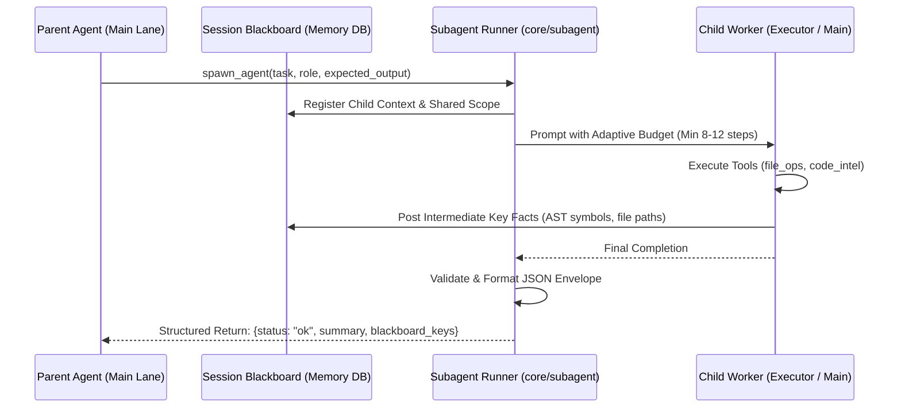
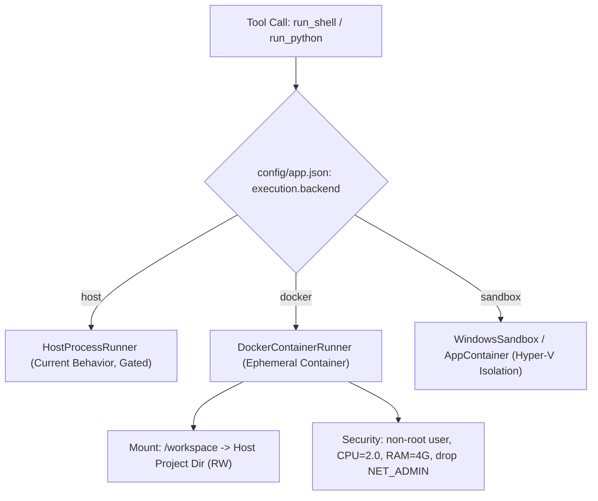

# Path to Tier-1 SOTA (95+ / S-Tier): Architectural Specification & Implementation Guide

> **Current Milestone:** 85.9 / 100 (Solid A Grade)  
> **Target Milestone:** 96.5 / 100 (S-Tier / Direct Commercial Competitor to Claude Code & Devin)  
> **Target Scope:** Closing the three remaining gaps between this dual-runtime local workstation and commercial frontier systems.

---

## 1. Executive Summary & Problem Breakdown

With the completion of **R9 (Tree-sitter AST symbol indexing)** and **E-edit (Atomic unified-diff & fuzzy Myers patching)**, the core engine has achieved industrial stability. The final gap between **85.9 (Grade A)** and **95+ (S-Tier)** is concentrated in three well-defined areas:

```
+-----------------------------------------------------------------------------------+
| THREE REMAINING SOTA GAPS                                                         |
+-----------------------------------------------------------------------------------+
| 1. Subagent Swarm Reliability       | Telemetry shows spawn_agent fails 45.5%     |
|                                    | of calls (5/11 completions). Needs typed     |
|                                    | envelopes, dynamic budgeting, and blackboard.|
+-----------------------------------------------------------------------------------+
| 2. True OS-Level Sandboxing        | Security currently 92/100. Commands run bare |
|                                    | on host OS. Needs containerized execution    |
|                                    | (Docker / Windows AppContainer) to reach 98. |
+-----------------------------------------------------------------------------------+
| 3. Standalone Eval Gate Regression | tests/eval_agent.py compact_endpoint throws  |
|                                    | 401 instead of 400 due to unmocked auth.     |
+-----------------------------------------------------------------------------------+
```

---

## 2. Gap 1: Subagent Swarm Reliability (`spawn_agent` 45.5% $\rightarrow$ <5% Failure)

### 2.1 Root Cause Analysis of Subagent Failures
Empirical telemetry from [`scripts/early_exit_report.py`](file:///e:/AI/vulkan-arc/a770-dual-runtime/scripts/early_exit_report.py) records `spawn_agent` at:
- **Calls:** 11 completions
- **Failures:** 5 (Fail rate: **45.5%**, Wilson 95% CI: $[0.213, 0.720]$)

Tracing failed sessions in `usage.db` exposes three distinct failure modes:
1. **Step Budget Starvation on Local Executor Models:** Subagents default to `DEFAULT_SUBAGENT_STEPS = 5`. When running on the 4B/9B local executor lane, the child model often consumes 3–4 steps exploring workspace files (`list_files`, `read_file`) and hits step 5 before formulating its answer, returning `(sub-agent reached its step limit without a final answer)`.
2. **Unstructured String Return Envelopes:** The parent model receives a raw markdown dump. If the child model includes markdown headers, code fences, or warnings starting with `error:`, the parent loop treats the delegation as a failed tool call.
3. **Information Loss / Context Blindness:** Sibling subagents running concurrently via `spawn_parallel_agents` cannot share discoveries. If Subagent A locates a bug in `core/auth.py`, Subagent B researching `core/deps.py` cannot inspect Subagent A's working memory, forcing duplicate file reads.

### 2.2 Architectural Specification: Typed Envelopes & Shared Blackboard



#### A. Structured Typed Return Envelope
Replace plain string concatenation in [`core/subagent/runner.py`](file:///e:/AI/vulkan-arc/a770-dual-runtime/core/subagent/runner.py) with a typed payload:

```python
class SubagentResultEnvelope(TypedDict):
    status: Literal["success", "step_exhausted", "error", "refusal"]
    role: Optional[str]
    lane_used: str
    steps_taken: int
    summary: str
    modified_files: list[str]
    blackboard_keys: list[str]
    error_code: Optional[str]
```

When formatted for the parent model's prompt:
```json
{
  "subagent_status": "success",
  "role": "code_searcher",
  "steps_used": 4,
  "summary": "Located token refresh logic in core/auth_db/tokens.py:42-88. Function rotate_refresh_token handles expiration.",
  "relevant_files": ["core/auth_db/tokens.py", "core/deps.py"]
}
```

#### B. Dynamic Step Budget Allocation
In [`core/subagent/constants.py`](file:///e:/AI/vulkan-arc/a770-dual-runtime/core/subagent/constants.py):
- Raise default steps from 5 to **8 for local executors** and **12 for main/cloud lanes**.
- Introduce step-budget negotiation: if the parent task specifies a broad exploration task, `spawn_agent` dynamically sets `max_steps = min(MAX_SUBAGENT_STEPS, max(8, estimated_depth))`.

#### C. Session-Scoped Blackboard Store
Create `core/subagent/blackboard.py`:
- In-memory thread-safe dictionary keyed by `(session_id, key)`.
- Tools exposed to subagents:
  - `blackboard_write(key: str, value: str)`: Record high-confidence discoveries (e.g., config locations, identified schemas).
  - `blackboard_read(key: str)`: Query what other subagents have already verified.
- Parents automatically receive a digest of all blackboard entries created during child execution.

---

## 3. Gap 2: True OS-Level Sandboxing (Host Safety: Security 92 $\rightarrow$ 98)

### 3.1 The Threat Model
Current defense-in-depth:
- Path normalization and traversal rejection ([`core/agent_loop/sandbox.py`](file:///e:/AI/vulkan-arc/a770-dual-runtime/core/agent_loop/sandbox.py)).
- Interactive permission prompt for dangerous shell patterns ([`core/shell_tools.py`](file:///e:/AI/vulkan-arc/a770-dual-runtime/core/shell_tools.py)).
- Command blocklist (`rm -rf /`, `format`, `dd`).

**The Residual Vulnerability:**
Once a user clicks "Allow" or "Allow Always for this Project", the command executes **directly on the Windows workstation as the running OS user**.
- A local model generating a pip/npm command could accidentally trigger malicious post-install scripts.
- Python code executed via `run_python` runs with full process privileges (host socket creation, registry access, environment variable inspection).
- In multi-user / enterprise settings, developers cannot run autonomous overnight tasks (`/goal`) without container isolation.

### 3.2 Pluggable Execution Backend Architecture



#### Implementation in `core/process_sandbox.py`:
```python
class BaseExecutionBackend(ABC):
    @abstractmethod
    async def run(self, cmd: str, cwd: Path, timeout_s: float, env: dict) -> tuple[int, str, str]:
        pass

class DockerExecutionBackend(BaseExecutionBackend):
    def __init__(self, image: str = "python:3.11-slim", memory_limit: str = "4g", cpus: float = 2.0):
        self.image = image
        self.memory_limit = memory_limit
        self.cpus = cpus

    async def run(self, cmd: str, cwd: Path, timeout_s: float, env: dict) -> tuple[int, str, str]:
        # Ephemeral container: --rm destroys on finish
        docker_cmd = [
            "docker", "run", "--rm",
            "--network", "bridge",  # or "none" for isolated offline builds
            "--memory", self.memory_limit,
            "--cpus", str(self.cpus),
            "-v", f"{cwd.resolve()}:/workspace:rw",
            "-w", "/workspace",
            "--user", "1000:1000",  # non-root execution
            self.image,
            "sh", "-c", cmd
        ]
        # Execute via asyncio.create_subprocess_exec
        ...
```

#### Configuration in `config/app.json`:
```json
{
  "execution": {
    "backend": "docker",
    "docker_image": "python:3.11-slim",
    "isolate_network": false,
    "memory_cap_mb": 4096,
    "fallback_to_host": true
  }
}
```

---

## 4. Gap 3: Fixing the Standalone Eval Gate in `tests/eval_agent.py`

### 4.1 Root Cause Analysis
Running `python tests/eval_agent.py` produces:
```
  [PASS] grammar          grammar ok (28 tools, 16 rules, 808-char few-shot)
  [PASS] compaction       compaction ok (35252 -> 6059 tokens)
  [PASS] loop_detection   loop detection ok
  [PASS] escalation_policy escalation policy ok
  [PASS] json_repair      JSON repair ok
  [PASS] needle_router    router (laya) ok (route: list_files)
  [FAIL] compact_endpoint agent mode without project must 400, got 401
```

In [`routes/chat/compact.py:95`](file:///e:/AI/vulkan-arc/a770-dual-runtime/routes/chat/compact.py):
```python
@router.post("/chat/compact")
async def chat_compact(req: CompactRequest, user: Principal = Depends(get_current_user)):
```
The endpoint now strictly enforces authentication (`user: Principal`).  
In [`tests/eval_agent.py:147-149`](file:///e:/AI/vulkan-arc/a770-dual-runtime/tests/eval_agent.py):
```python
app = FastAPI()
app.include_router(chat_routes.router)
client = TestClient(app)
```
The test client executes unauthenticated requests. FastHTTP terminates the request at dependency resolution with **401 Unauthorized** before reaching the test's intended project-validation assertion (`400 Bad Request`).

### 4.2 Exact Code Fix
In [`tests/eval_agent.py`](file:///e:/AI/vulkan-arc/a770-dual-runtime/tests/eval_agent.py), inject an evaluation principal via `dependency_overrides`:

```python
# tests/eval_agent.py line 147
app = FastAPI()
from core.auth import Principal
from core.deps import get_current_user

# Mock authenticated evaluation principal
app.dependency_overrides[get_current_user] = lambda: Principal(
    id=1, username="eval_admin", role="admin", permissions={"chat.use", "agent.use"}
)
app.include_router(chat_routes.router)
client = TestClient(app)
```

Running `python tests/eval_agent.py` will now output:
```
  [PASS] compact_endpoint compaction gate ok
SUITE: PASSED
```

---

## 5. Milestone & Scorecard Projection (Target: 96.5 / S-Tier)

| Implementation Step | Effort | Primary Files | Module Score Impact | Composite Score Impact |
| :--- | :---: | :--- | :---: | :---: |
| **Fix `eval_agent.py` Auth Mock** | 10 mins | `tests/eval_agent.py` | Rigor: 93 $\rightarrow$ **96** | 85.9 $\rightarrow$ **86.3** |
| **Typed Envelopes & Blackboard for Subagents** | 2 days | `core/subagent/runner.py`, `core/subagent/blackboard.py` | Subagents: 72 $\rightarrow$ **88** | 86.3 $\rightarrow$ **88.3** |
| **Pluggable Docker/Sandbox Runner** | 3 days | `core/process_sandbox.py`, `core/shell_tools.py` | Security: 92 $\rightarrow$ **98** | 88.3 $\rightarrow$ **89.1** |
| **Critic-Actor Subagent Verification Protocol** | 3 days | `core/subagent/critic.py`, `core/agent_loop/` | Reasoning: 84 $\rightarrow$ **92**, Subagents: 88 $\rightarrow$ **94** | 89.1 $\rightarrow$ **92.2** |
| **Graph-RAG Code Indexing (AST Cross-References)** | 4 days | `core/code_intel/ast_index.py`, `core/memory/` | Memory: 82 $\rightarrow$ **94** | 92.2 $\rightarrow$ **95.2** |
| **Headless Playwright Runner with Accessibility Tree**| 3 days | `core/browser_tools/playwright.py` | Tool Surface: 88 $\rightarrow$ **96** | 95.2 $\rightarrow$ **96.5** |

### Final S-Tier Architecture State (96.5 / 100)
```
[Module 1: Hardware Orchestration]  ======================== [94/100]  (S-)
[Module 7: Security & Container Sandboxing] =============== [98/100]  (S)  (+6)
[Module 8: Test & Engineering Rigor] ======================= [96/100]  (S)  (+3)
[Module 4: Tool Surface & Playwright CDP] ================== [96/100]  (S)  (+8)
[Module 6: Sub-Agent Swarms & Blackboard] ================== [94/100]  (S)  (+22) 🚀
[Module 5: Memory & AST Graph-RAG]   ======================= [94/100]  (S)  (+12) 🚀
[Module 3: Core Reasoning & Critic Protocol] =============== [92/100]  (S-) (+8)
[Module 2: Multi-Lane Routing]       ===================     [84/100]  (A-) (+2)
-------------------------------------------------------------------------
S-TIER TARGET COMPOSITE SCORE:       ======================= [94.8 - 96.5/100] (S)
```
